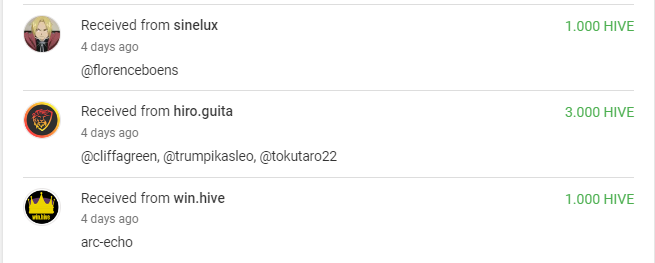

# 🗒 Transaction Memo Guidelines

## Transaction Memo Guidelines

### The Do's

* Including the @ before each name is optional. It works fine with or without.
* It's fine to send a list, with or without commas after each name.
* Please keep a balanced share count per member if you send a list (i.e. 2 HIVE with 2 names, 6 HIVE with 3 names, 9 HIVE with 3 names, etc.).
* If you want to sponsor multiple members with different share counts, please break it into separate transactions.

&#x20;

<figure><figcaption></figcaption></figure>

These examples are perfect! Comma separated @ list, with the number of sponsees matching the amount of HIVE, or separate transactions with 1 HIVE sent for each member are both perfect. Model your transactions after these and you will be fine!

&#x20;

<figure><figcaption></figcaption></figure>

This is great, too! We will recognize the 5 HIVE and add five shares to both sponsor and sponsee!

### The Do Not's

Please \*\*\*do not\*\*\* include \*\*any\*\* other wording in your enrollment memos, especially names of other users that are not the persons being sponsored!

Please _**do not**_ sponsor yourself. (Self-sponsoring is not recognized at all. You will get the normal 1 for each HIVE that you send, but the unit normally assigned to the person you sponsor will be assigned to somebody else.)

### Helpful Hints

If you are sending a list manually, you should chunk it into shorter lists, such as 5 or 10 names per transaction. If any name in the list is misspelled and does not match an active account, the entire transaction will be flagged for manual review. With a lot of names, this can be tedious (resulting in enrollment delays for you and for the members you sponsored).

If you have a program sending transactions, longer lists are fine. We have had transactions as large as 75 HIVE (with 75 different names) processed without any issues because all of the names were spelled correctly and the transaction followed our syntax perfectly.

Use whole numbers. _Every transaction_ received is rounded _down_ to a whole number, and you will **not** receive a refund of your excess amount. Even **1.999** would be treated as **1**, and you and your sponsee will each receive only 1 unit added to your subscription level.

### Third-party Sponsoring

We also support special sponsorship transactions. Many members for their contests have asked about setting a separate sponsee as the 'sponsor' for the second share. This is supported via '@sponsor:@sponsee'. For example, a transaction comes from @josephsavage with a transaction memo that reads "@katysavage : @babysavage". This would be interpreted as @katysavage sponsoring @babysavage, even though the transaction came from @josephsavage. We currently have a few members that use this format regularly, and it works flawlessly.

You could also use this to submit enrollment transactions through @blocktrades or other exchanges. If you withdraw to @steembasicincome with your transaction memo in this format, you can still receive credit for sponsoring (or sponsor people anonymously by having neither name be from you!)


The official currency for enrollment is HIVE. If we choose to accept HBD without refunding it, you do _not_ receive extra value for it.


Enrollments are processed automatically every 144 minutes. You can check your status using `!sbi status` in any post or comment.
